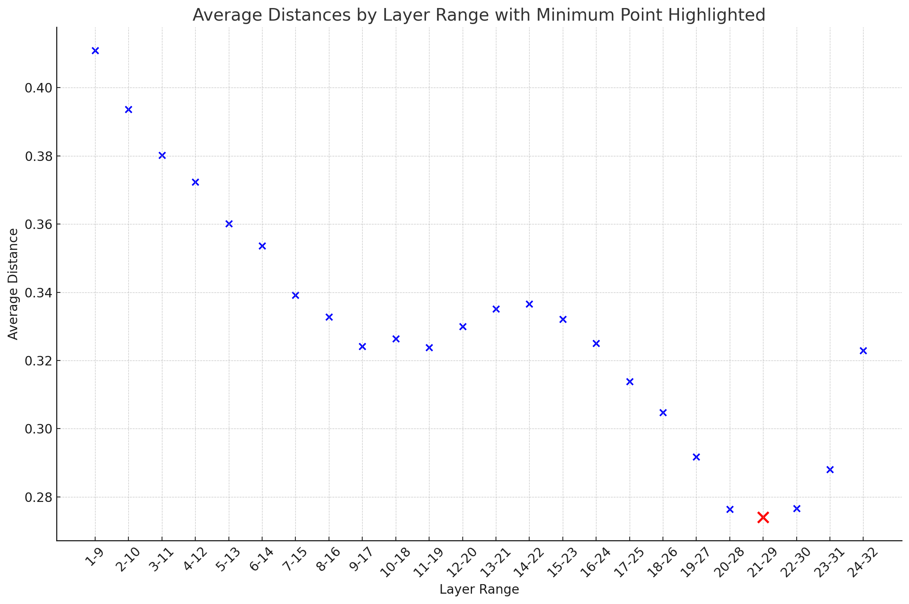

# Layer Pruning of Large Language Models

This repository hosts the [unofficial] implementation of a layer pruning strategy for Large Language Models (LLMs) based on the insights from the paper "[The Unreasonable Ineffectiveness of the Deeper Layers](https://arxiv.org/abs/2403.17887)" by Andrey Gromov et al. The paper empirically demonstrates that LLMs can have a substantial number of their layers removed with minimal performance degradation, especially on question-answering benchmarks.

## Summary of the Paper

The authors present a straightforward method for pruning layers from popular pretrained LLMs. They identify optimal blocks of layers for pruning by analyzing similarity across layers. The approach suggests that deeper layers in these LLMs are often more redundant than previously thought. After pruning, the model can be "healed" using Parameter-Efficient Fine-tuning (PEFT) methods like QLoRA to recover from the pruning-induced performance loss. These findings open avenues for significant computational resource reduction during both fine-tuning and inference stages, potentially improving memory and latency without severe impacts on performance.

## Repository Structure

The codebase is divided into two main parts:

### First compute the block/layer similarity given a dataset

Navigate to the `compute_block_similarity` directory to run the layer similarity computation script.

1. Open `run_layer_similarity.sh`.
2. Replace the placeholder arguments with your model and dataset information:

```bash
python layer_similarity.py --model_path "mistralai/Mistral-7B-Instruct-v0.2" \
                      --dataset "arcee-ai/sec-data-mini" \
                      --dataset_column "text" \
                      --batch_size 8 \
                      --max_length 1024 \
                      --layers_to_skip 8 \
                      --dataset_size 4000 \
                      --dataset_subset "train" 
```

3. Execute the script to get the most optimum layer/block range to prune.

### Create the new model with the [Mergekit](https://github.com/arcee-ai/mergekit)

After identifying the layers to prune, you can proceed to the `slice_with_mergekit` directory. Here, you can leverage the MergeKit library to prune the identified layers from the model effectively.


## Observations and Insights

Our findings corroborate the theory presented in the paper `The Unreasonable Ineffectiveness of the Deeper Layers`—that some portions of deeper layers in LLMs like `mistralai/Mistral-7B-Instruct-v0.2` can be pruned with minimal performance degradation. Specifically, we observed a pattern of high redundancy in deeper layers, aligning with the hypothesis that not all layers contribute equally to the model's performance. This redundancy indicates potential for computational efficiency improvements without sacrificing the quality of outcomes. Following this strategy, the pruned model can be found in the [arcee-ai/Mistral-7B-Instruct-v0.2-sliced-24-layer](https://huggingface.co/arcee-ai/Mistral-7B-Instruct-v0.2-sliced-24-layer), and it can generate coherent text, demonstrating the practical applicability of our pruning approach.



## Use Cases

The layer pruning strategy detailed in the paper and implemented in this codebase is beneficial for:

- Reducing the computational requirements of LLMs without significant performance loss.
- Facilitating fine-tuning and potential continuous pretraining of pruned models.
- Initial experiments suggest the pruned models can still generate coherent text.
- When combined with techniques like QLoRA, pruned models can heal from performance drops efficiently.

## Advanced Use Cases

By pruning larger models and continuing pre-training with domain-specific datasets, this strategy could revolutionize the way we merge smaller domain-adapted LLMs into larger ones through Data Flow Space (DFS) Merging, facilitating efficient domain adaptation.


